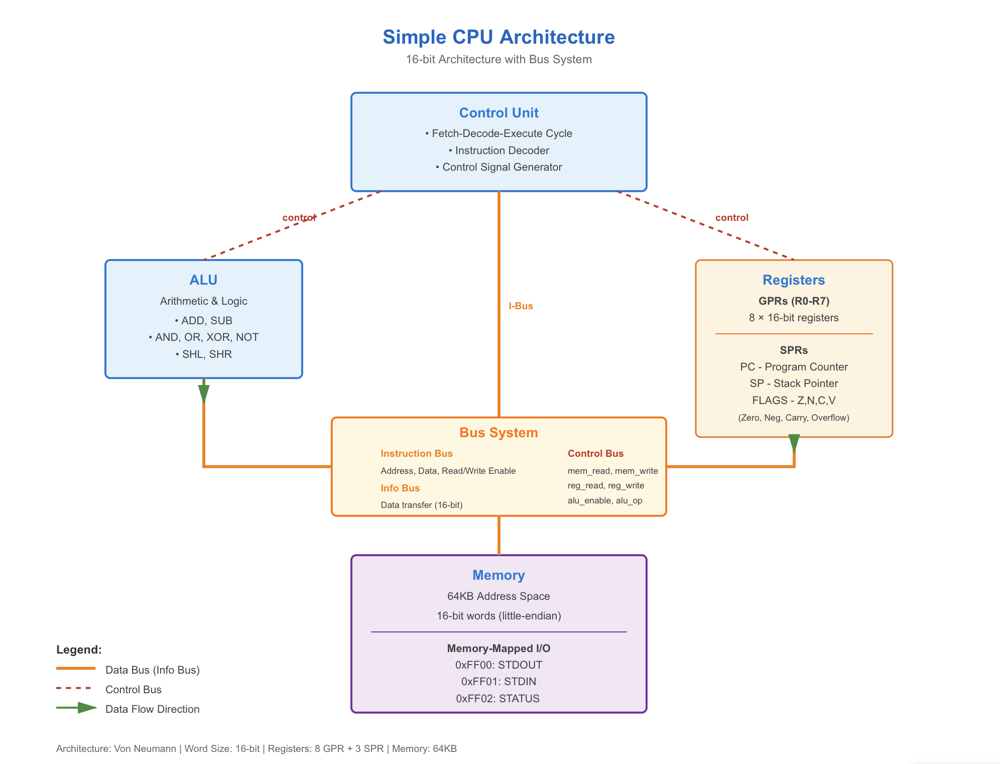

# Simple CPU Emulator

A complete software CPU emulator implemented in C++ with modular design, featuring a custom instruction set, assembler, and example programs.

## Features

- **Modular Architecture**: Each CPU component is represented by appropriate classes/structs
- **Complete ISA**: 16-bit instruction set with arithmetic, logic, memory, and control flow operations
- **Assembler**: Full assembler with label and literal support
- **Debugging**: Instruction tracing and state inspection
- **Memory-Mapped I/O**: Character output support
- **Example Programs**: Timer, Hello World, and Fibonacci sequence


## Building

```bash
make
```

This will create the `cpu_emulator` executable.

## Usage

### Interactive Mode

```bash
./cpu
```

Available commands:
- `load <file>` - Load and assemble program from file
- `run` - Run program until halt
- `step` - Execute one instruction
- `gpr` - Print General Purpose Registers
- `spr` - Print Special Purpose Registers
- `ram [addr] [len]` - Print RAM dump (default: 0x0000, 256 bytes)
- `dec [addr] [cnt]` - Print memory as decimal numbers (default: 0x0040, 10 words)
- `state` - Print complete CPU state
- `trace on/off` - Enable/disable instruction tracing
- `reset` - Reset CPU to initial state
- `help` - Show help message
- `quit/exit` - Exit emulator

### Direct Execution

```bash
# Load and run a program directly
./cpu_emulator programs/hello.asm run
./cpu_emulator programs/fibonacci.asm run
./cpu_emulator programs/timer.asm run
```

### Example Session

```bash
$ ./cpu_emulator
> load programs/fibonacci.asm
Program loaded: 25 instructions
Labels:
  start: 0x0
  loop: 0x1a
  done: 0x3a

> trace on
Trace enabled

> step
=== Cycle 1 ===
PC: 0x0000
[FETCH] Instruction at PC: 0xb000
[DECODE] LDI R0, #0
[EXECUTE] R0 = 0
[STORE] PC updated to 0x0002

=== CPU State ===
Cycle: 1
=== General Purpose Registers ===
R0: 0x0000 (0)
R1: 0x0000 (0)
...

> run
> state

> dec
=== Memory as Decimal Numbers ===
Starting address: 0x0040
[00] 0x0040: 0
[01] 0x0042: 1
[02] 0x0044: 1
[03] 0x0046: 2
[04] 0x0048: 3
[05] 0x004a: 5
[06] 0x004c: 8
[07] 0x004e: 13
[08] 0x0050: 21
[09] 0x0052: 34
```

## CPU Components

### Registers
- **GPRs (General Purpose Registers)**: 8 registers (R0-R7), 16-bit each
- **SPRs (Special Purpose Registers)**: PC (Program Counter), SP (Stack Pointer), FLAGS

### ALU
Performs arithmetic and logical operations, returns result with flags (overflow, carry, zero, negative).

### Control Unit
Orchestrates the fetch-decode-execute cycle, manages program counter, and controls all CPU components.

### Bus System
- **Instruction Bus**: Two-way communication for instruction fetch
- **Info Bus**: Data transfer between components
- **Control Bus**: One-way control signals from Control Unit

### Memory
- 64KB address space
- Memory-mapped I/O at 0xFF00-0xFFFF
- Byte-addressable, word-aligned

## Instruction Set

See [docs/ISA.md](docs/ISA.md) for complete instruction set documentation.

Key instructions:
- **Arithmetic**: ADD, SUB
- **Logic**: AND, OR, XOR, NOT
- **Shifts**: SHL, SHR
- **Memory**: LD, ST
- **Immediate**: LDI
- **Control Flow**: JMP, JZ, JNZ, HLT

## Example Programs

### Hello World (`programs/hello.asm`)
Outputs "Hello, World!" using memory-mapped I/O.

### Fibonacci (`programs/fibonacci.asm`)
Computes the first 10 Fibonacci numbers and stores them in memory starting at address 0x0040. Use the `dec` command to view the stored numbers as decimal values.

### Timer (`programs/timer.asm`)
Demonstrates Fetch/Compute/Store cycles by counting down from 10 to 0.

## Architecture

See [docs/CPU_SCHEMATIC.md](docs/CPU_SCHEMATIC.md) for detailed architecture documentation.

### Architecture Diagram



## Design Principles

1. **Modularity**: Each component is self-contained and well-defined
2. **Traceability**: Control flow is visible through trace output
3. **Debuggability**: Easy inspection of registers, memory, and CPU state
4. **Extensibility**: Easy to add new instructions or components

## Notes

- Instructions are 16 bits wide
- Memory is little-endian
- Immediate values are 6-bit signed (-32 to 31)
- Program counter increments by 2 (instruction size)
- Stack pointer initialized to 0xFFFF (top of memory)

## License

This project is part of a course assignment.

